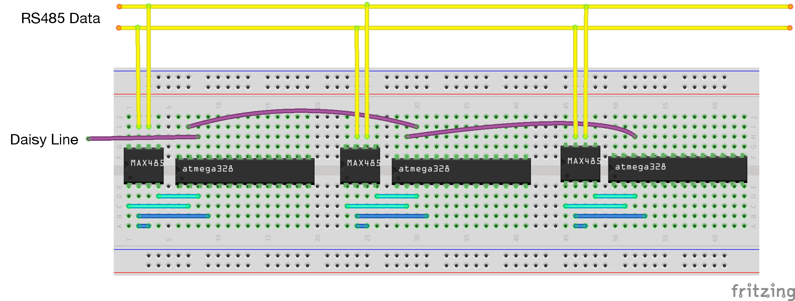

# AVR Disco Bus

A versatile AVR/Arduino library for communicating on a multidrop master/slave bus, like RS485.
Put simply, it's an easy way to communication with a lot of devices over a pair of twisted wires.

You can read more about the Disco Bus [protocol spec here](https://github.com/jgillick/Disco-Bus-Protocol)

## Implementation Quickstart

This is the most basic master/server setup where the slave node address is known and master
just sends messages to it. (see the [simple example](examples/01_simple))


### Slave

```cpp
DiscobusDataUart serial;
DiscobusSlave slave(&serial);

serial.begin(9600);
slave.setAddress(0x01);

while(1) {
  slave.read();
  if (slave.hasNewMessage() && slave.isAddressedToMe()) {
    // Do something with the received message
    // See: slave.getCommand() and slave.getData()
  }
}
```

### Master

```c
DiscobusDataUart serial;
DiscobusMaster master(&serial);

serial.begin(9600);

// send command 0xA1, to node 1, message data length will be 2
master.startMessage(0xA1, 0x01, 2);
master.sendData('H');
master.sendData('i');
master.finishMessage();
```

### Explanation

The `DiscobusDataUart` object is what is used to facilitate communication on the wire,
in this case over the standard Rx/Tx UART. Once this is created, `DiscobusMaster` and
`DiscobusSlave` use it to receive, parse and send messages to each other.

## Multibus Circuit

Here's an example of 3 nodes connected together on one RS485 bus
(this simplified diagram does not include power, clock crystals or decoupling caps).



## More Examples

There are more complex examples in the [examples directory](/MultidropBusProtocol/examples/).

## Fun Fact
The direction of the daisy lines are determined dynamically. The node will wait
to see which side becomes enabled and then assume that is the input daisy line.


# License

> MIT License
>
> Copyright (c) 2016 Jeremy Gillick
>
> Permission is hereby granted, free of charge, to any person obtaining a copy
> of this software and associated documentation files (the "Software"), to deal
> in the Software without restriction, including without limitation the rights
> to use, copy, modify, merge, publish, distribute, sublicense, and/or sell
> copies of the Software, and to permit persons to whom the Software is
> furnished to do so, subject to the following conditions:
>
> The above copyright notice and this permission notice shall be included in all
> copies or substantial portions of the Software.
>
> THE SOFTWARE IS PROVIDED "AS IS", WITHOUT WARRANTY OF ANY KIND, EXPRESS OR
> IMPLIED, INCLUDING BUT NOT LIMITED TO THE WARRANTIES OF MERCHANTABILITY,
> FITNESS FOR A PARTICULAR PURPOSE AND NONINFRINGEMENT. IN NO EVENT SHALL THE
> AUTHORS OR COPYRIGHT HOLDERS BE LIABLE FOR ANY CLAIM, DAMAGES OR OTHER
> LIABILITY, WHETHER IN AN ACTION OF CONTRACT, TORT OR OTHERWISE, ARISING FROM,
> OUT OF OR IN CONNECTION WITH THE SOFTWARE OR THE USE OR OTHER DEALINGS IN THE
> SOFTWARE.